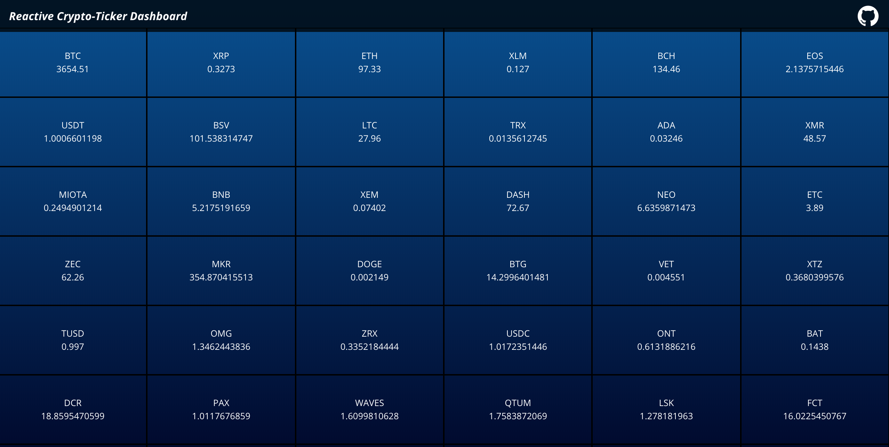

<h1>TICKER - Real time cryptotransactions ticker</h1>

## Technology Stack:

<ul>
<li>nodeJS</li>
<li>reactJS</li>
<li>axios</li>
<li>socket.io</li>
</ul>

## Reactive Component - breakdown:

## Streaming:

- Streaming is done via Cryptocompare Streamer
- Cryptocompare has finer streaming control on CryptoTickers

Basic usage of cryptocompare and approach used in this solution is:

- Streaming URL: 'https://streamer.cryptocompare.com/
- socket.io-client is used to connect/subscribe to market updates

- Streaming subscription key: Format: {SubscriptionId}~{ExchangeName}~{FromSymbol}~{ToSymbol}
- Use SubscriptionId 0 for TRADE, 2 for CURRENT, 5 for CURRENTAGG eg use key '5~CCCAGG~BTC~USD' to get aggregated data from the CCCAGG exchange 
- For Full Volume Format: 11~{FromSymbol} eg use '11~BTC' to get the full volume of BTC against all tickerEntity pairs
- For aggregate quote updates use CCCAGG ags market

<h3>Live demo: <a href="https://rxcryptoticker.herokuapp.com/">https://rxcryptoticker.herokuapp.com/</a></h3>

<h3>Requirements:</h3>
<ul>
  <li><a href="https://git-scm.com">Git</a> and <a href="https://nodejs.org">Node</a> installed</li>
  <li>No API keys required</li>
</ul>

<h3>Local deployment:</h3>
<ol>
  <li>Enter command line</li>
  <li>Clone repository: <code>git clone https://github.com/kanthgithub/rxCryptoTicker.git</code></li>
  <li>Enter repository: <code>cd rxCryptoTicker</code></li>
  <li>Install packages: <code>npm install</code></li>
  <li>Run with: <code>npm start</code></li>
  <li>Browse: <code>http://127.0.0.1:3000</code></li>
  <li>Stop with: <code>CTRL+C</code></li>
</ol>

This application uses:  
 <a href="https://coinmarketcap.com/api/">CoinMarketCap API</a> for Crypto-Ticker-Static  
 <a href="https://www.cryptocompare.com/api">CryptoCompare WebSocket API</a> to listen market-data updates.

